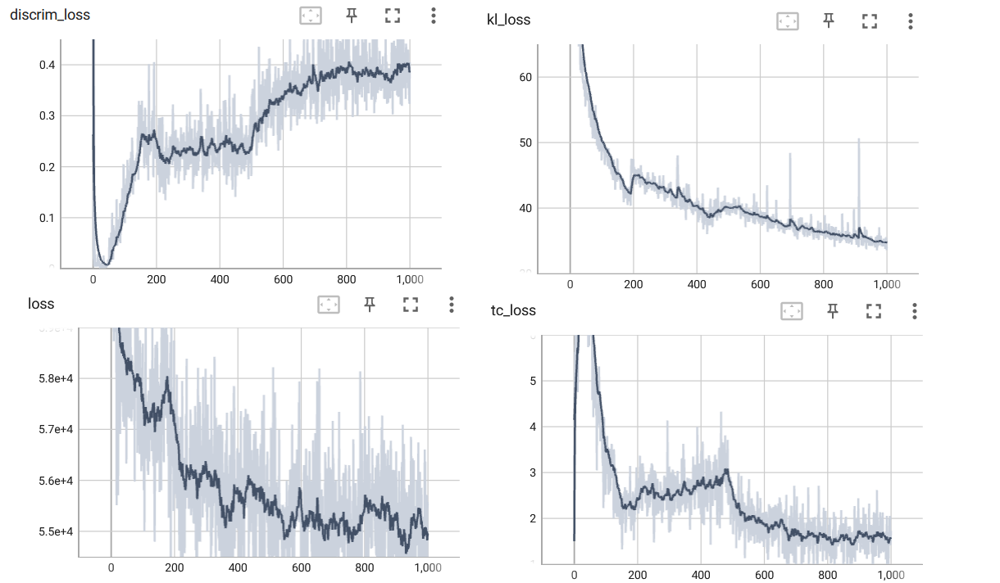
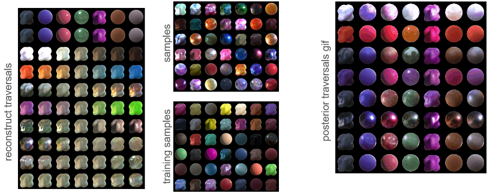

# Learning interpretable representations of material appearance

This repository contains the code used during the master thesis of Santiago Jiménez Navarro in the Master Program in Robotics, Graphics and Computer Vision. It builds on top of the original [Disentangled VAE](https://github.com/YannDubs/disentangling-vae#disentangled-vae--) and the [Disentanglement Lib](https://github.com/google-research/disentanglement_lib) repositories.

## Set up
1. Install the required packages using the `requirements.txt` file. 
2. Download the necessary files:

 - The Serrano21 (LDR) [dataset](https://mig.mpi-inf.mpg.de/). Move the `color_chnl` folder to `data/serrano`, rename it to `color_chnl_original` and execute the script `change_shape.py`.
 - Background [masks](https://drive.google.com/drive/folders/1wfcutJ0ufLhvcA3wA3B8EcxuX2w9C9Dy?usp=sharing). Place them in `data/serrano/one_exr_per_geom`.

3. Modify the file `hyperparam.ini` to make sure that the paths are correct in your machine.

## Dataset
Now that we have the original Serrano21 dataset, we can build the subset that we want, for example, executing the `get_masked.py` script with the option 1 (the variable `mode` inside the script). This will generate a folder called `masked-serrano`, which should be the value of the `training_dataset` variable in the `hyperparam.ini` file.

## Train
Run the training command, specifying all the required parameters, for example:

    python main.py factor_serrano_test -d serrano -l factor --lr 0.0005 -b 128 -e 1000 -z 20 -f 500 --lr-disc 0.00001

After the training is complete, two new folders will be created with the results, whose path is defined in the `hyperparam.ini` file (by default named `results` and `runs`).

To check the development of the training, you can use Tensorboard. For example, by running `tensorboard --logdir "disentangling-vae-master/runs"` and then opening `http://localhost:6006/` in a browser, you should see plots similar to these:

 

## Test

Test the trained model, using the `main_viz.py` script. For example, to generate all the plots, run:

    python main_viz.py factor_serrano_test all -r 8 -c 7

This should give a result similar to this:

 
